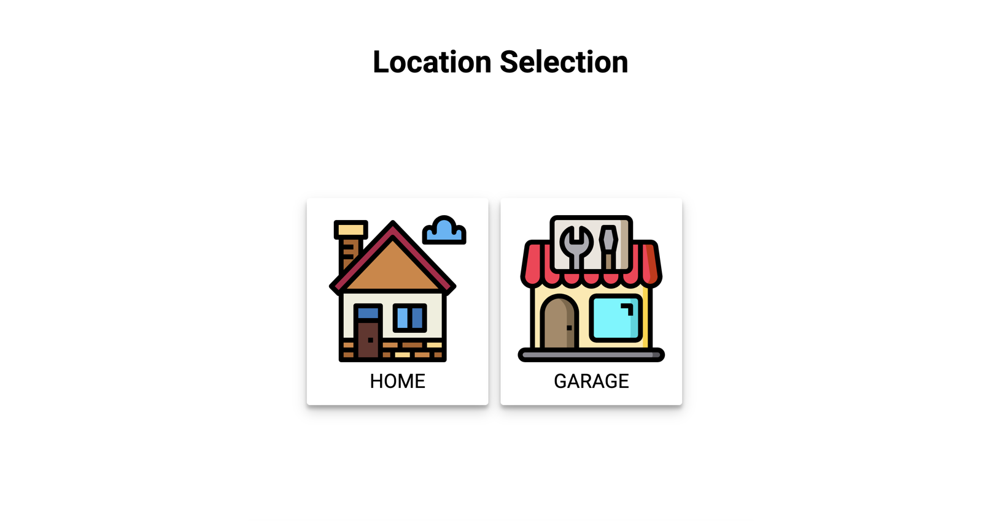

# Виртуальный пульт для управления умным домом
## Task 
Необходимо реализовать виртуальный пульт для управления умным домом.

## Launching the app
* Git clone
* Запустить postgres и создать БД 'sber':
  * user: 'admin'
  * password: 123
* Развернуть таблицу БД с помощью скрипта в папке `server/createDB/db/index.js`
* Добавить данные в БД с помощью скрипта в папке `server/createDB/db/seed.js`
* Подтянуть зависимости командой `npm i` или `yarn`
* Запустить backend командой `npm server` или `yarn server`
* Запустить client командой `npm start` или `yarn start`

